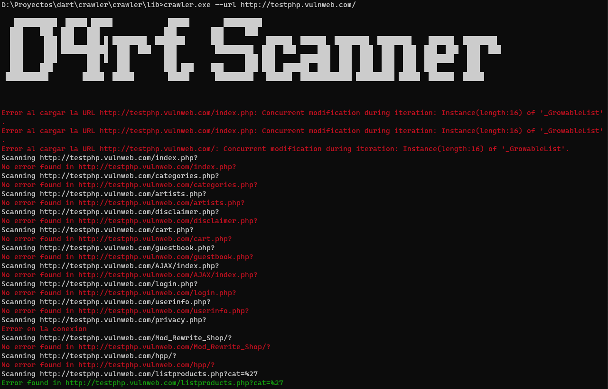

Este es un simple ejemplo de un crawler y scanner de sqli programado en dart, para ampliar mis conocimientos en este lenguaje de programacion.
El programa funciona con 3 Clases

# CrawlerEnDart

1. ClassCrawler -> Se encarga de capturar los enlaces con el numero de profundidad establecido
2. ClassFilter -> Se encarga de que no se repitan los enlaces
3. ClassScanner -> Es el prototipo de scanner por el momento solo detecta sqli por error

crawler.dart --> Es el main principal donde se establece la url 

Para ejecutar el programa

dart crawler.dart --url http://testphp.vulnweb.com/ -d 3

--url --> Es la pagina a scannear

-d -> Es el numero de profundidad que sacara los enlaces en la pagina web

